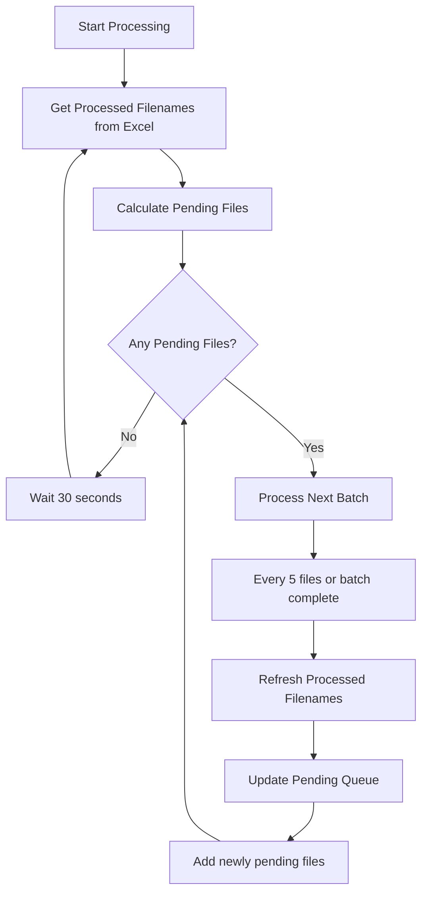
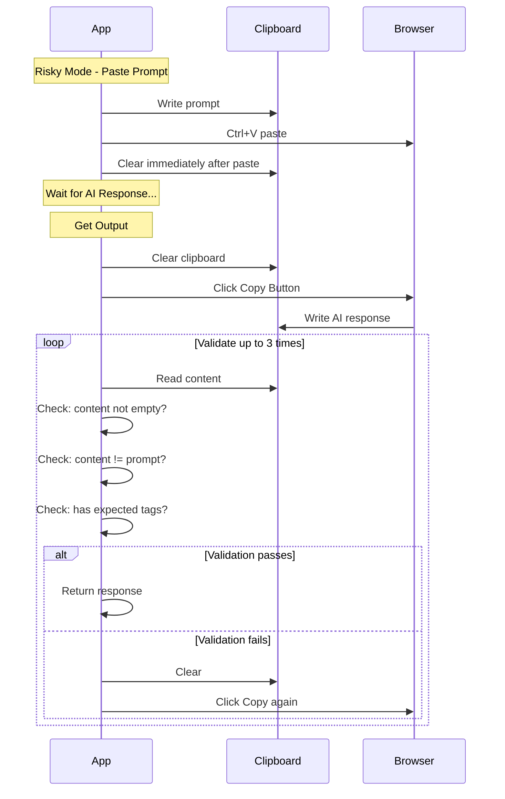

# Implementation Plan: Continuous File Review & Clipboard Handling

## Overview

This plan addresses two key enhancements to `main.py`:

1. **Continuous File Review**: Allow the app to periodically re-check the Excel file for missing entries, enabling users to delete rows and trigger re-processing
2. **Clipboard Conflict Resolution**: Handle the conflict between using clipboard for prompt input (risky mode) and output retrieval (copy button)

---

## Problem Analysis

### Problem 1: Static File Review

**Current Behavior:**
- Files are checked for processing status once at startup via [`get_processed_filenames()`](main.py:244)
- The pending files list is determined before the main processing loop begins
- If a user deletes an entry from Excel during processing, the app won't know to re-process that file

**User Need:**
- Users may want to re-generate results for specific files
- The only way to trigger this is by deleting the corresponding row in Excel
- The app should detect these deletions and add the file back to the processing queue

### Problem 2: Clipboard Conflict in Risky Mode

**Current Behavior:**
- In risky mode (`--risky`), the prompt is written to clipboard and pasted via Ctrl+V
- Output retrieval requires clicking the copy button (the ONLY reliable method)
- Both operations share the same clipboard
- Current mitigation: Uses `CLIPBOARD_LOCK` and clears clipboard before reading

**The Risk:**
- With concurrent tabs, timing issues could cause prompt content to be read instead of AI output
- The clipboard content after copy-click might still contain the prompt if the copy failed

---

## Proposed Solutions

### Solution 1: Continuous File Review with Periodic Refresh

#### Approach: Hybrid Periodic + Event-Driven

Implement a system that:
1. Re-checks processed files periodically (after every N files processed)
2. Re-checks after each batch of waiting tasks completes
3. Continues processing until no pending files remain

#### Implementation Details



#### Code Changes Required

1. **New function: `refresh_pending_files()`**
   - Re-reads Excel to get current processed files
   - Compares against original file list
   - Returns any files that are now pending (were processed, now deleted from Excel)

2. **Modify `process_files_logic()`**
   - Convert from single-pass to continuous loop
   - Add refresh interval (every 5 files or configurable)
   - Integrate newly pending files into the processing queue
   - Add idle polling when no files pending (configurable interval)

3. **New CLI option: `--continuous`**
   - Enable/disable continuous monitoring mode
   - Default: disabled (current behavior preserved)

4. **New CLI option: `--refresh-interval`**
   - Number of files between each Excel refresh check
   - Default: 5

5. **New CLI option: `--idle-poll-interval`**
   - Seconds to wait when no files pending before re-checking
   - Default: 30

---

### Solution 2: Robust Clipboard Handling

#### Approach: Content Validation + Retry Strategy

Since the copy button is the ONLY reliable way to get output, we need to ensure we're reading the actual AI response, not stale clipboard content.

#### Strategy Components

1. **Pre-copy clipboard clearing**: Clear clipboard before clicking copy
2. **Content validation**: Verify clipboard content looks like a valid response
3. **Prompt comparison**: Ensure clipboard content differs from the prompt
4. **Retry mechanism**: If validation fails, retry the copy operation



#### Implementation Details

1. **New function: `validate_ai_response()`**
   - Check response is not empty
   - Check response differs from the prompt (using hash or length comparison)
   - Optionally check for expected tag patterns
   - Returns boolean indicating validity

2. **New function: `get_ai_response_with_validation()`**
   - Clear clipboard
   - Click copy button
   - Read clipboard
   - Validate response
   - Retry if invalid (up to 3 attempts)

3. **Modify `interact_and_send()`**
   - In risky mode: Clear clipboard immediately after pasting
   - Store a hash/signature of the prompt for comparison

4. **Modify `wait_and_save()`**
   - Replace direct clipboard read with validated read
   - Add prompt signature to function parameters for comparison

5. **Add prompt tracking**
   - Pass prompt hash/signature through the processing pipeline
   - Use for validation in output retrieval

---

## Detailed Code Changes

### File: `main.py`

#### 1. Add new imports and constants

```python
import hashlib

# Configuration constants
DEFAULT_REFRESH_INTERVAL = 5  # files between Excel checks
DEFAULT_IDLE_POLL_INTERVAL = 30  # seconds to wait when idle
```

#### 2. Add prompt hashing utility

```python
def hash_prompt(prompt: str) -> str:
    """Generate a short hash of the prompt for comparison."""
    return hashlib.md5(prompt.encode()).hexdigest()[:16]
```

#### 3. Add response validation function

```python
def validate_ai_response(
    response: str, 
    prompt_hash: str, 
    tags: List[str],
    original_prompt: str
) -> bool:
    """
    Validate that clipboard content is a valid AI response.
    
    Checks:
    - Response is not empty
    - Response hash differs from prompt hash
    - Response is not identical to prompt
    - Response contains at least one expected tag with content
    """
    if not response or not response.strip():
        return False
    
    response_hash = hash_prompt(response)
    if response_hash == prompt_hash:
        return False
    
    # Length-based quick check (response should be different length)
    if len(response) == len(original_prompt) and response == original_prompt:
        return False
    
    # Check for at least one tag with content
    if tags:
        from selectolax.parser import HTMLParser
        tree = HTMLParser(response)
        for tag in tags:
            node = tree.css_first(tag)
            if node and node.text(strip=True):
                return True
        return False  # No tags found with content
    
    return True  # No tags to validate, accept non-empty different content
```

#### 4. Add robust clipboard reading function

```python
async def get_ai_response_with_validation(
    tab,
    copy_button,
    prompt_hash: str,
    original_prompt: str,
    tags: List[str],
    filename: str,
    max_attempts: int = 3
) -> Optional[str]:
    """
    Get AI response from clipboard with validation and retry.
    
    Returns the validated response text or None if all attempts fail.
    """
    for attempt in range(max_attempts):
        # Clear clipboard before copy
        try:
            await tab.execute_script("navigator.clipboard.writeText('')")
        except Exception as e:
            click.echo(f"Warning: Could not clear clipboard: {e}", err=True)
        
        await asyncio.sleep(random.uniform(0.3, 0.6))
        
        # Click copy button
        await copy_button.click(
            x_offset=random.randint(-12, 12),
            y_offset=random.randint(-8, 8),
            hold_time=random.uniform(0.15, 0.35),
        )
        
        await asyncio.sleep(random.uniform(0.5, 1.0))
        
        # Read clipboard with retries
        response_text = ""
        for read_attempt in range(3):
            clipboard_result = await tab.execute_script(
                "return navigator.clipboard.readText()", await_promise=True
            )
            
            try:
                response_text = clipboard_result["result"]["result"]["value"]
            except (KeyError, TypeError):
                response_text = ""
            
            if response_text:
                break
            await asyncio.sleep(random.uniform(0.3, 0.5))
        
        # Validate response
        if validate_ai_response(response_text, prompt_hash, tags, original_prompt):
            if attempt > 0:
                click.echo(
                    click.style(f"Got valid response on attempt {attempt + 1} ({filename})", fg="green")
                )
            return response_text
        
        click.echo(
            click.style(
                f"Invalid response on attempt {attempt + 1}/{max_attempts} ({filename}), retrying...",
                fg="yellow"
            ),
            err=True
        )
        await asyncio.sleep(random.uniform(0.5, 1.0))
    
    return None
```

#### 5. Add continuous file refresh function

```python
def refresh_pending_files(
    all_files: List[Path],
    current_pending: List[Path],
    output_file: Path,
    name_column: str
) -> Tuple[List[Path], int]:
    """
    Refresh the pending files list by re-checking Excel.
    
    Returns:
        Tuple of (updated pending list, count of newly added files)
    """
    processed_filenames = get_processed_filenames(output_file, name_column=name_column)
    
    # Find files that are pending (not in Excel)
    newly_pending = []
    for f in all_files:
        if f.stem not in processed_filenames:
            # Check if already in current pending list
            if f not in current_pending:
                newly_pending.append(f)
    
    if newly_pending:
        click.echo(
            click.style(
                f"Found {len(newly_pending)} file(s) needing re-processing",
                fg="magenta"
            )
        )
        for f in newly_pending:
            click.echo(f"  + {f.name}")
    
    # Combine: current pending + newly pending, preserving order
    updated_pending = list(current_pending) + newly_pending
    
    return updated_pending, len(newly_pending)
```

#### 6. Modify `interact_and_send()` signature and behavior

```python
async def interact_and_send(
    browser, tab, file_path: Path, message: str, 
    risky_mode: bool = False
) -> Tuple[Any, str]:  # Now returns (tab, prompt_hash)
    """
    Realiza a interação até clicar em 'Enviar'.
    Retorna a aba ativa e o hash do prompt.
    """
    prompt_hash = hash_prompt(message) if risky_mode else ""
    
    # ... existing code ...
    
    # In risky mode section, after paste:
    if risky_mode:
        async with CLIPBOARD_LOCK:
            await tab.execute_script(f"navigator.clipboard.writeText({json_message})")
            await asyncio.sleep(0.5)
            await tab.keyboard.hotkey(Key.CONTROL, Key.V)
            # NEW: Clear clipboard immediately after paste
            await asyncio.sleep(0.3)
            await tab.execute_script("navigator.clipboard.writeText('')")
    
    # ... rest of existing code ...
    
    return tab, prompt_hash  # Return both
```

#### 7. Modify `wait_and_save()` signature

```python
async def wait_and_save(
    tab,
    file_path: Path,
    output_file: Path,
    tags: List[str],
    name_column: str = "Arquivo",
    prompt_hash: str = "",  # NEW parameter
    original_prompt: str = "",  # NEW parameter
):
    """
    Aguarda a resposta em uma aba já ativa e salva no Excel.
    Now uses validated clipboard reading.
    """
    # ... existing wait for copy button code ...
    
    async with CLIPBOARD_LOCK:
        if prompt_hash:
            # Use validated reading
            response_text = await get_ai_response_with_validation(
                tab, copy_button, prompt_hash, original_prompt, 
                tags, filename
            )
        else:
            # Original behavior for non-risky mode
            # (existing clipboard read logic)
            pass
    
    # ... rest of existing code ...
```

#### 8. Modify `process_files_logic()` for continuous mode

```python
async def process_files_logic(
    files: List[Path],
    output_file: Path,
    message: str,
    tags: List[str],
    start_time: Optional[time] = None,
    stop_time: Optional[time] = None,
    disable_headless: bool = False,
    risky_mode: bool = False,
    name_column: str = "Arquivo",
    continuous: bool = False,  # NEW
    refresh_interval: int = DEFAULT_REFRESH_INTERVAL,  # NEW
    idle_poll_interval: int = DEFAULT_IDLE_POLL_INTERVAL,  # NEW
):
    """Lógica principal com suporte a modo contínuo."""
    
    all_files = list(files)  # Keep original list for refresh
    
    # ... browser setup code (unchanged) ...
    
    # Main continuous loop
    while True:
        # Get/refresh pending files
        processed_filenames = get_processed_filenames(output_file, name_column=name_column)
        pending_files = [f for f in all_files if f.stem not in processed_filenames]
        
        if not pending_files:
            if continuous:
                click.echo(
                    click.style(
                        f"No pending files. Polling in {idle_poll_interval}s...",
                        fg="cyan"
                    )
                )
                await asyncio.sleep(idle_poll_interval)
                continue
            else:
                click.echo(
                    click.style("All files processed. Done.", fg="green")
                )
                break
        
        click.echo(f"{len(pending_files)} files pending...")
        
        files_processed_this_batch = 0
        
        for i, file_path in enumerate(pending_files):
            # Schedule check
            if start_time and stop_time:
                if not is_within_schedule(start_time, stop_time):
                    await wait_until_schedule_starts(start_time, stop_time)
            
            # Process file...
            # (existing processing code with updated function calls)
            
            files_processed_this_batch += 1
            
            # Periodic refresh check
            if continuous and files_processed_this_batch >= refresh_interval:
                click.echo("Checking for newly pending files...")
                pending_files, added = refresh_pending_files(
                    all_files, pending_files[i+1:], output_file, name_column
                )
                files_processed_this_batch = 0
                if added > 0:
                    # Restart the inner loop with updated list
                    break
        
        # After batch completion
        if not continuous:
            break
    
    # ... cleanup code ...
```

#### 9. Add new CLI options

```python
@click.option(
    "--continuous",
    "-c",
    is_flag=True,
    default=False,
    help="Enable continuous monitoring mode (re-checks Excel periodically)",
)
@click.option(
    "--refresh-interval",
    "-ri",
    type=int,
    default=5,
    help="Number of files between Excel refresh checks (default: 5)",
)
@click.option(
    "--idle-poll-interval",
    "-ipi",
    type=int,
    default=30,
    help="Seconds to wait when no files pending before re-checking (default: 30)",
)
def main(prompt, paths, output, start, stop, disable_headless, name_column, risky,
         continuous, refresh_interval, idle_poll_interval):
    # ... existing code ...
    
    asyncio.run(
        process_files_logic(
            files,
            output_file,
            message_content,
            tags,
            parsed_start,
            parsed_stop,
            disable_headless,
            risky,
            name_column=name_column,
            continuous=continuous,
            refresh_interval=refresh_interval,
            idle_poll_interval=idle_poll_interval,
        )
    )
```

---

## Testing Strategy

### Test Cases for Continuous File Review

1. **Basic re-processing trigger**
   - Start processing with 10 files
   - While processing, delete 1 entry from Excel
   - Verify the deleted file gets re-processed

2. **Multiple deletions**
   - Delete multiple entries during processing
   - Verify all deleted files get re-processed

3. **Idle polling**
   - Complete all files, enter idle state
   - Delete an entry while idle
   - Verify file gets picked up within poll interval

4. **Schedule interaction**
   - Test that continuous mode respects schedule windows
   - Verify idle polling pauses outside schedule

### Test Cases for Clipboard Handling

1. **Response validation - valid response**
   - Process a file with valid tags
   - Verify response is different from prompt
   - Verify tags have content

2. **Response validation - empty clipboard**
   - Simulate empty clipboard after copy
   - Verify retry mechanism triggers
   - Verify success on subsequent attempt

3. **Response validation - stale prompt**
   - Simulate clipboard containing prompt
   - Verify detection and retry
   - Verify eventually gets correct response

4. **Concurrent tab safety**
   - Process multiple files in parallel
   - Verify no clipboard cross-contamination

---

## Risk Assessment

| Risk | Likelihood | Impact | Mitigation |
|------|------------|--------|------------|
| Excel file locked during refresh | Medium | Low | Existing retry logic handles this |
| Continuous mode high CPU usage | Low | Medium | Idle polling with configurable interval |
| Response validation false negatives | Low | High | Multiple validation criteria + retries |
| Copy button click fails | Medium | Medium | Existing retry logic + new validation retry |

---

## Implementation Order

1. **Phase 1: Clipboard Handling** (Lower risk, foundational)
   - Add `hash_prompt()` function
   - Add `validate_ai_response()` function
   - Add `get_ai_response_with_validation()` function
   - Modify `interact_and_send()` to return prompt hash
   - Modify `wait_and_save()` to use validated reading
   - Test risky mode thoroughly

2. **Phase 2: Continuous File Review**
   - Add `refresh_pending_files()` function
   - Add new CLI options
   - Modify `process_files_logic()` for continuous loop
   - Test continuous mode with manual Excel edits

3. **Phase 3: Integration Testing**
   - Test both features together
   - Test with schedule options
   - Test edge cases (empty Excel, all files processed, etc.)

---

## Summary

This implementation provides:

1. **Continuous monitoring** via `--continuous` flag with configurable refresh and idle intervals
2. **Robust clipboard handling** through content validation, prompt comparison, and retry mechanisms
3. **Backward compatibility** - all new features are opt-in via CLI flags
4. **Resilience** - multiple layers of validation and retry logic

The design leverages existing Pydoll patterns and maintains the current architecture while adding the requested functionality.
